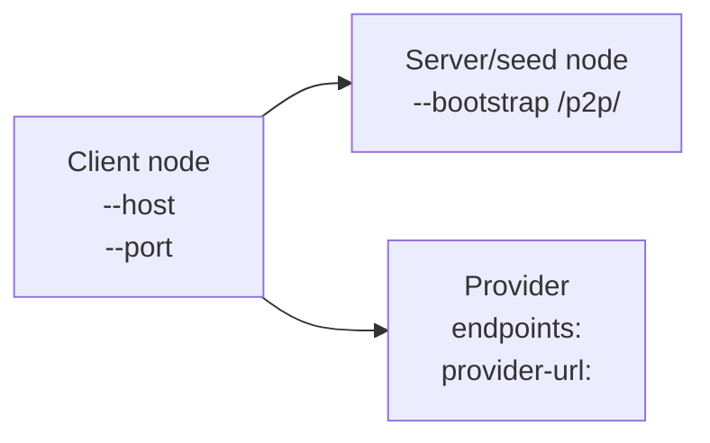
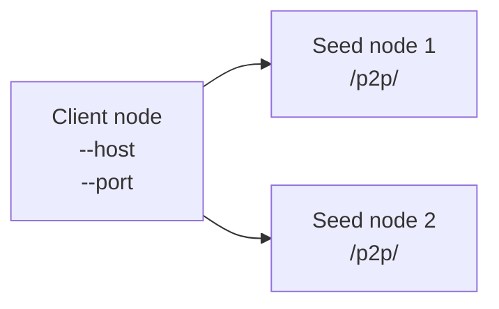

# Client provider record put/get (ticket #48)

## CLI subcommands

- `decent-registry put provider` publishes a signed provider update.
- `decent-registry get provider` resolves a provider record.

---

## Provider lookup key

DHT key is the literal `--object-hash` value (64 hex chars).

- `put provider` stores a canonical signed envelope under:
  - `/decent-registry/provider/{object_hash}`
- `get provider` queries the same DHT key.

---

## Network topology: where `--host`/`--port`, `--bootstrap`, and the provider record fit

The client runs a temporary libp2p node using `--host`/`--port` to connect to the Kad-DHT.
The server/seed node is reached via the `--bootstrap` multiaddr (the peer’s advertised listen multiaddr), which the client uses for peer/DHT discovery during `put`/`get provider`.

After the client `get`s the provider record, it uses the provider’s stored endpoint multiaddrs (`--endpoint`) plus the provider’s `--provider-url` to download the object.



### Using multiple bootstrap seeds

`--bootstrap` accepts **multiple** seed multiaddrs. In this repo, the CLI defines `--bootstrap` as `action="append"`, so each `--bootstrap <MADDR>` adds one seed to the list.

#### Accepted multiaddr list shapes

1) Repeated flags (produces a list of multiaddrs)

```bash
--bootstrap <BOOTSTRAP1>
--bootstrap <BOOTSTRAP2>
```

2) Comma-separated inside one flag (also flattened into a list)

```bash
--bootstrap "<BOOTSTRAP1>,<BOOTSTRAP2>"
```

3) YAML config list (server `network.bootstrap`, and also client `network.bootstrap` if set)

```yaml
network:
  bootstrap:
    - "<BOOTSTRAP1>"
    - "<BOOTSTRAP2>"
```

Where each `<BOOTSTRAP...>` is an identify-style multiaddr with peer id:

- `/ip4/<IP>/tcp/<PORT>/p2p/<PEER_ID>`

#### Network topology (2 seed nodes)



#### Example client command (connect to both seeds)

```bash
decent-registry get provider \
  --host 127.0.0.1 \
  --port <CLIENT_PORT> \
  --bootstrap <SEED1_LISTEN_MULTIADDR>/p2p/<SEED1_PEERID> \
  --bootstrap <SEED2_LISTEN_MULTIADDR>/p2p/<SEED2_PEERID> \
  --object-hash <OBJECT_HASH>
```

## `put provider` usage

### Minimal invocation

```bash
# 1) Generate a signing key (once)

decent-registry keygen --output ~/.decent/owner_privkey.pem

# 2) Download an example artifact and compute its SHA-256 object hash

curl -LO https://github.com/curl/curl/releases/download/curl-8_7_1/curl-8.7.1.tar.gz
OBJECT_HASH="$(sha256sum curl-8.7.1.tar.gz | awk '{print $1}')"
# OBJECT_HASH must equal:
# f91249c87f68ea00cf27c44fdfa5a78423e41e71b7d408e5901a9896d905c495

# 3) Provide the downloadable object URL itself (field 4 in the provider payload)

PROVIDER_URL="https://github.com/curl/curl/releases/download/curl-8_7_1/curl-8.7.1.tar.gz"

# Put seq=1

# Note: --bootstrap origin
# - Start a seed node
# - Copy the startup line printed by the server:
#   [BOOTSTRAP] <listen_multiaddr>/p2p/<peer_id>
# - Use that entire multiaddr as the --bootstrap value

decent-registry put provider \
  --host 127.0.0.1 \
  --port <CLIENT_PORT> \
  --bootstrap <SEED_LISTEN_MULTIADDR>/p2p/<SEED_PEERID> \
  --object-hash "$OBJECT_HASH" \
  --provider-url "$PROVIDER_URL" \
  --owner-privkey ~/.decent/owner_privkey.pem \
  --seq 1 \
  --endpoint /ip4/127.0.0.1/tcp/9000
```

### Endpoint validation and signing

From `src/decent_registry/provider_schema.py`:

- `--endpoint` values are repeatable and are merged by the CLI into a list (comma-separated supported by the CLI).
- Each endpoint must:
  - start with `/` (multiaddr syntax)
  - be ≤ 256 UTF-8 bytes
- The endpoint list is limited to **32** entries.
- Before signing, endpoints are normalized to **lexicographically sorted order**.

So: the payload committed to the signature always uses `endpoints = sorted(endpoints)`.

### How `--host`/`--port` relate to `--endpoint`

- `--host`/`--port` in `put provider` / `get provider` define the client’s temporary libp2p node listen address used to join the Kad-DHT (via `--bootstrap`).
- `--endpoint` values are the provider’s advertised service locations (multiaddrs) stored in the provider record payload and returned by `get provider`.

### What `provider_url` represents

- `provider_url` is stored in the provider payload as field `4`.
- It is the downloadable object URL (must be `http://` or `https://`).
- It is validated to be ≤ 2048 UTF-8 bytes.

---

## `get provider` usage

### Minimal invocation

```bash
# Note: --bootstrap origin
# - Start a seed node; capture the printed line:
#   [BOOTSTRAP] <listen_multiaddr>/p2p/<peer_id>
# - Use that entire multiaddr as the --bootstrap value
# See docs/multi-node-cluster-setup.md.
decent-registry get provider \
  --host 127.0.0.1 \
  --port <CLIENT_PORT> \
  --bootstrap <SEED_LISTEN_MULTIADDR>/p2p/<SEED_PEERID> \
  --object-hash f91249c87f68ea00cf27c44fdfa5a78423e41e71b7d408e5901a9896d905c495
```

### What `get provider` prints

On success, stdout is a single JSON object (`json.dumps(..., indent=2, sort_keys=True)`), with keys:

```json
{
  "object_key": "f91249c87f68ea00cf27c44fdfa5a78423e41e71b7d408e5901a9896d905c495",
  "provider_url": "<URL>",
  "endpoints": ["<multiaddr>", ...]
}
```

- `endpoints` are returned in the normalized/sorted form.

On missing, stdout is `not found` and the command exits non-zero.

---

## Seq monotonic overwrite and owner collision rules

For a fixed provider DHT key (= `object_hash`):

- `seq` must be **strictly increasing** (`seq <= prev.seq` is rejected).
- An overwrite is rejected if the signer’s `owner_public_key` changes ("owner collision").
- Canonical CBOR + signature validity are required.

---

## Runnable end-to-end example (single copy/paste)

This script:

- starts a temporary libp2p Kad-DHT seed node
- generates an Ed25519 private key PEM file
- performs `put provider` seq=1, then seq=2
- verifies that a seq=1 overwrite is rejected
- performs `get provider` and verifies returned fields

Run from the repo root (`/home/ben/projects/decent-registry`):

```bash
python3 - <<'PY'
import json
import os
import queue
import shutil
import socket
import subprocess
import tempfile
import threading
import trio

from pathlib import Path

from cryptography.hazmat.primitives.serialization import (
    Encoding,
    NoEncryption,
    PrivateFormat,
)
from cryptography.hazmat.primitives.asymmetric.ed25519 import Ed25519PrivateKey
from libp2p.crypto.ed25519 import create_new_key_pair
from decent_registry.dht.libp2p_dht import Libp2pKadDHT


def free_port() -> int:
    s = socket.socket()
    s.bind(("127.0.0.1", 0))
    p = s.getsockname()[1]
    s.close()
    return p


def start_seed(seed_port: int, alive_seconds: float = 25.0):
    ready_q: "queue.Queue[tuple[str, str]]" = queue.Queue(maxsize=1)

    def runner():
        async def seed_main():
            async with Libp2pKadDHT(listen=f"/ip4/127.0.0.1/tcp/{seed_port}") as dht:
                peer_id = dht.host.get_id().to_string()
                listen = dht.get_listen_multiaddr()
                ready_q.put((peer_id, listen))
                await trio.sleep(alive_seconds)

        trio.run(seed_main)

    t = threading.Thread(target=runner, daemon=True)
    t.start()
    peer_id, listen = ready_q.get(timeout=10)
    bootstrap = f"{listen}/p2p/{peer_id}"
    return t, bootstrap


def write_privkey_pem(tmpdir: Path) -> Path:
    kp = create_new_key_pair()
    seed = kp.private_key.to_bytes()  # 32-byte Ed25519 seed

    priv = Ed25519PrivateKey.from_private_bytes(seed)
    pem_bytes = priv.private_bytes(
        encoding=Encoding.PEM,
        format=PrivateFormat.PKCS8,
        encryption_algorithm=NoEncryption(),
    )

    pem_path = tmpdir / "owner_privkey.pem"
    pem_path.write_bytes(pem_bytes)
    os.chmod(pem_path, 0o600)
    return pem_path


exe_path = Path.cwd() / ".venv" / "bin" / "decent-registry"
if exe_path.exists():
    exe = str(exe_path)
else:
    exe = shutil.which("decent-registry")
    if not exe:
        raise RuntimeError("decent-registry not found; activate .venv first")

obj = "f91249c87f68ea00cf27c44fdfa5a78423e41e71b7d408e5901a9896d905c495"
provider_url = "https://github.com/curl/curl/releases/download/curl-8_7_1/curl-8.7.1.tar.gz"

endpoints = [
    "/ip4/127.0.0.1/tcp/10002",
    "/ip4/127.0.0.1/tcp/10001",  # intentionally unsorted
]
expected_endpoints = sorted(endpoints)

with tempfile.TemporaryDirectory() as td:
    tmpdir = Path(td)

    seed_port = free_port()
    _, seed_bootstrap = start_seed(seed_port, alive_seconds=25.0)

    client_port_1 = free_port()
    client_port_2 = free_port()
    client_port_3 = free_port()
    client_port_get = free_port()

    owner_priv_pem_path = write_privkey_pem(tmpdir)

    def run_cli(args):
        cp = subprocess.run([exe] + args, capture_output=True, text=True, timeout=60)
        return cp

    put1 = run_cli([
        "put",
        "provider",
        "--host", "127.0.0.1",
        "--port", str(client_port_1),
        "--bootstrap", seed_bootstrap,
        "--object-hash", obj,
        "--provider-url", provider_url,
        "--owner-privkey", str(owner_priv_pem_path),
        "--seq", "1",
        "--endpoint", ",".join(endpoints),
    ])
    assert put1.returncode == 0, (put1.stdout, put1.stderr)

    put2 = run_cli([
        "put",
        "provider",
        "--host", "127.0.0.1",
        "--port", str(client_port_2),
        "--bootstrap", seed_bootstrap,
        "--object-hash", obj,
        "--provider-url", provider_url,
        "--owner-privkey", str(owner_priv_pem_path),
        "--seq", "2",
        "--endpoint", ",".join(endpoints),
    ])
    assert put2.returncode == 0, (put2.stdout, put2.stderr)

    # Attempt overwrite with lower seq; should be rejected.
    put3 = run_cli([
        "put",
        "provider",
        "--host", "127.0.0.1",
        "--port", str(client_port_3),
        "--bootstrap", seed_bootstrap,
        "--object-hash", obj,
        "--provider-url", provider_url,
        "--owner-privkey", str(owner_priv_pem_path),
        "--seq", "1",
        "--endpoint", ",".join(endpoints),
    ])
    assert put3.returncode != 0, (put3.stdout, put3.stderr)

    get1 = run_cli([
        "get",
        "provider",
        "--host", "127.0.0.1",
        "--port", str(client_port_get),
        "--bootstrap", seed_bootstrap,
        "--object-hash", obj,
    ])
    assert get1.returncode == 0, (get1.stdout, get1.stderr)

    record = json.loads(get1.stdout)
    assert record["object_key"] == obj
    assert record["provider_url"] == provider_url
    assert record["endpoints"] == expected_endpoints

    print(json.dumps(record, indent=2, sort_keys=True))
PY
```
